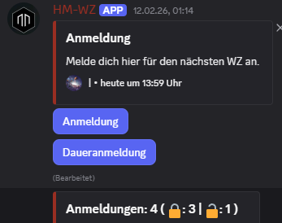

# HM-WZ


HM-WZ ist ein modularer Discord-Bot zur Verwaltung von Anmeldungen, Rollen und Übersichten – entwickelt speziell für die WZ-Planung im Spiel **Hadestar**.

Der Bot wurde als Lernprojekt in Python (ab Version 3.12.9) konzipiert und legt Wert auf Übersichtlichkeit, Datensicherheit und einfache Erweiterbarkeit. Er unterstützt Admins und Moderatoren dabei, Anmeldungen zu erfassen, Rollen automatisiert zu vergeben und den aktuellen Status jederzeit als CSV zu exportieren oder im Discord-Channel anzuzeigen.

**Hauptfunktionen:**
- Verwaltung von Anmeldungen und Registrierungen direkt im Discord-Server
- Automatische Rollenzuweisung und -entfernung
- Export und Reset von Registrierungsdaten
- Flexible Konfiguration über Slash-Commands
- Übersichtliche Darstellung und einfache Bedienung

**Technischer Fokus:**
Der Bot nutzt moderne Discord-APIs (discord.py), speichert alle relevanten Daten sicher in einer lokalen Datenbank und ist für den Einsatz auf privaten wie öffentlichen Servern geeignet. Die Architektur ist so gestaltet, dass neue Commands und Features leicht ergänzt werden können.



## Commands – Übersicht & Details

### Gruppe: WZ

#### Untergruppe: Registrierung

**/csv**  
_Exportiert alle aktuellen Registrierungen als CSV-Datei._
- Rechte: `Manage Roles`, `Manage Messages`, `Manage Channels` (Bot: `Attach Files`)
- Ablauf: Prüft Konfiguration, sammelt Registrierungen, erstellt und sendet eine CSV-Datei (Usernamen, Rollen, Timestamps).

**/reset**  
_Entfernt alle nicht-permanenten Registrierungen und zugehörige Anmeldungsrollen von den Usern._
- Rechte: `Manage Roles`, `Manage Messages`, `Manage Channels`
- Ablauf: Sammelt alle nicht-permanenten Registrierungen, entfernt Rollen, löscht Einträge aus der Datenbank, synchronisiert die Übersicht.

### Untergruppe: Setup

**/configure**  
_Einrichten der WZ-Registrierung für diesen Server._
- Rechte: `Manage Roles`, `Manage Messages`, `Manage Channels`
- Parameter: `channel: TextChannel`, optional `role: Role`
- Ablauf: Setzt den Registrierungskanal und (optional) eine Rolle. Prüft Rechte und Rollenhierarchie, synchronisiert die Übersicht.

**/role-add**  
_Fügt eine Anmeldungsrolle für die Registrierung hinzu (maximal 4 Rollen möglich)._  
- Rechte: `Manage Roles`, `Manage Messages`, `Manage Channels`
- Parameter: `role: Role`, optional `permanent: bool`
- Ablauf: Fügt eine Rolle zur Registrierung hinzu, prüft Limit und Rechte.

**/role-remove**  
_Entfernt eine Anmeldungsrolle aus der Registrierung._  
- Rechte: `Manage Roles`, `Manage Messages`, `Manage Channels`
- Parameter: `role` (Autocomplete, Rolle wählen)
- Ablauf: Entfernt eine Rolle aus der Registrierung, prüft Mindestanzahl.

**/message**  
_Legt die Nachricht für die WZ-Registrierung fest._  
- Rechte: `Manage Roles`, `Manage Messages`, `Manage Channels`
- Optionen: `title`, `message` oder `message_upload` (.txt)
- Hinweis: Nutze `DiscordMessageExample.txt` als Vorlage für die Nachricht (Titel, Beschreibung, Anmeldeschluss etc.).

---

## Datensicherheit & Datenbank
Die Datenbank speichert alle wichtigen IDs (User, Rollen, Channel) und Konfigurationen. Sie ist für die Funktionalität des Bots essenziell, da:
- alle Registrierungen und Einstellungen nach Neustart erhalten bleiben,
- automatisierte Auswertungen, Resets und Exporte nur so möglich sind,
- IDs dauerhaft Discord-Objekte referenzieren (auch bei Namensänderungen).
---

## Installation

Die folgende Anleitung beschreibt die manuelle Installation unter Windows und Linux.

**Alternativ:**
Im Projekt befinden sich die Installationsskripte `install.bash` (Linux/macOS) und `install.ps1` (Windows PowerShell), die viele der untenstehenden Schritte automatisieren können.

**Hinweis:** Die Skripte werden ohne Gewähr bereitgestellt. Prüfe den Inhalt vor der Ausführung und passe sie ggf. an dein System an. Für Fehler, Datenverlust oder unerwünschte Änderungen wird keine Haftung übernommen.

### Abhängigkeiten
- discord.py
- aiosqlite (für asynchrones SQLite3)
- psutil (optional, für Ressourcenüberwachung)


Wichtige Hinweise:
- Verwende eine virtuelle Umgebung (`venv`), um Projektabhängigkeiten isoliert zu halten.
- Speichere Bot-Tokens niemals in Versionskontrolle (z. B. Git).
- Annahme: Die Startdatei des Bots ist `Bot.py`.

1) Python installieren
- Windows: Installer von https://www.python.org/downloads herunterladen und während der Installation **"Add Python to PATH"** aktivieren. Prüfen: `python --version` oder `py -3 --version`.
- Linux (Debian/Ubuntu):
    ```bash
    sudo apt update
    sudo apt install -y python3 python3-venv python3-pip
    python3 --version
    ```

2) pip aktualisieren
```bash
python -m pip install --upgrade pip
# Bei mehreren Python-Versionen: python3 -m pip install --upgrade pip
```

3) Virtuelle Umgebung erstellen und aktivieren (empfohlen)
```bash
python -m venv .venv
# Aktivieren:
# Windows (CMD): .venv\Scripts\activate
# Windows (PowerShell): .venv\Scripts\Activate.ps1
# Linux/macOS: source .venv/bin/activate
```

4) Abhängigkeiten installieren
- Falls vorhanden: `requirements.txt` benutzen:
```bash
pip install -U -r requirements.txt
```
- Alternativ einzelne Pakete installieren, z. B. mit `pip install discord.py`.

5) Bot-Token anlegen (zwei Optionen)

- A) Umgebungsvariable (empfohlen)
	- Windows (CMD, dauerhaft):
		```cmd
		setx HSBOT_TOKEN "dein-token-hier"
		```
		Danach neues Terminal öffnen. Prüfen: `echo %WZ_BOT_TOKEN%`
	- Windows (PowerShell, nur aktuelle Session):
		```powershell
		$env:HSBOT_TOKEN = "dein-token-hier"
		```
	- Linux (Session):
		```bash
		export HSBOT_TOKEN="dein-token-hier"
		```
		Dauerhaft (bash): `echo 'export WZ_BOT_TOKEN="dein-token-hier"' >> ~/.bashrc`
	- In Python lesen:
		```python
		import os
		token = os.getenv("WZ_BOT_TOKEN")
		```

- B) Windows-Registry (nur wenn gewünscht)
	- Anlegen (CMD):
		```cmd
		reg add "HKCU\Software\HsBot" /v Token /t REG_SZ /d "dein-token-hier" /f
		```
	- In Python lesen:
		```python
		import winreg
		key = winreg.OpenKey(winreg.HKEY_CURRENT_USER, r"Software\HsBot")
		token, _ = winreg.QueryValueEx(key, "Token")
		```
	- Hinweis: Registry ist weniger portabel; Umgebungsvariablen sind einfacher für Container/CI/Services.

6) Bot starten / testen
```bash
# Im Projektordner, venv aktiviert
python Bot.py
```

7) Sicherheit & Betrieb
- Für produktiven Betrieb Dienste/Services verwenden (z. B. systemd auf Linux, Windows Service) und Umgebungsvariablen für den Dienst setzen.
- Logs befinden sich ggf. im `logs/`-Verzeichnis des Projekts.

## Lizenz
